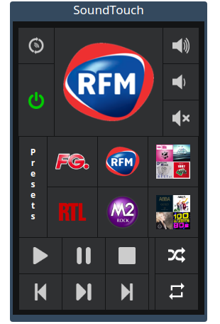

# Description 

Ce plugin permet de contrôler les enceintes Bose SoundTouch.

Rendu visuel de la télécommande :

# Configuration du plugin

Après téléchargement du plugin, il vous suffit juste d’activer celui-ci, il n’y a aucune configuration à ce niveau.

# Configuration des équipements

Pour se faire ajouter et paraméter une enceinte, cliquer sur *Plugins / Multimédia / Bose SoundTouch*

Puis cliquer sur l'icône **Ajouter** et définir :

- Nom de l'équipement
- Objet parent
- Sa catégorie (optionnelle)
- Cocher *Activer* pour que l'équipement soit utilisable
- Cocher *Visible* pour le rendre visible sur le dashboard
- Nom d'hôte ou l'adresse IP de l'enceinte

Pour terminer, cliquer sur **Sauvegarder** et l'enceinte est prête à être contrôler

