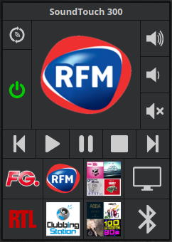

 **Documentation du plugin Bose SoundTouch**

> A partir d'octobre 2020, la plugin pour la version 3 de Jeedom ne bénéficiera plus des nouvelles mises à jour. Il sera necessaire de migrer vers la version 4 pour profiter des nouvelles fonctionnalités et des corrections.

# Description 

Ce plugin permet de contrôler les enceintes Bose SoundTouch.

On peut dorénavant choisir entre 2 styles de widget.

Rendu visuel du widget *Télécommande* / *Player* :

 

**Accès aux infos** :
- Source sélectionnée, Etat de l'enceinte
- Volume, son coupé
- Etat de lecture, pause
- Preview, artiste, titre
- Shuffle, repéter tous ou un seul

**Actions possibles** :
- Allumage, arrêt de l'enceinte
- Volume : ajustement en pourcentage, mute, up, down
- Choix des présélections
- Play, pause, stop, piste suivante et précédente
- Activation du shuffle et repeat
- Selection TV ou Bluetooth ou AUX

***Remarque*** : TV ne fonctionne seulement si une TV est connectée en sortie de l'enceinte en HDMI. AUX ne fonctionne que sur certaines enceintes et est maintenant déprécié par Bose.

# Configuration du plugin

Après téléchargement du plugin, il vous suffit juste d’activer celui-ci, il n’y a aucune configuration à ce niveau.

# Configuration des équipements

Pour se faire ajouter et paraméter une enceinte, cliquer sur *Plugins / Multimédia / Bose SoundTouch*

Puis cliquer sur l'icône **Ajouter** et définir :

- Nom de l'équipement
- Objet parent
- Cocher *Activer* pour que l'équipement soit utilisable
- Cocher *Visible* pour le rendre visible sur le dashboard
- Nom d'hôte ou l'adresse IP de l'enceinte
- Format du widget

Pour terminer, cliquer sur **Sauvegarder** et l'enceinte est prête à être contrôler

# Forum

Accès à la page du plugin du forum de Jeedom : https://www.jeedom.com/forum/viewtopic.php?f=142&t=44945
